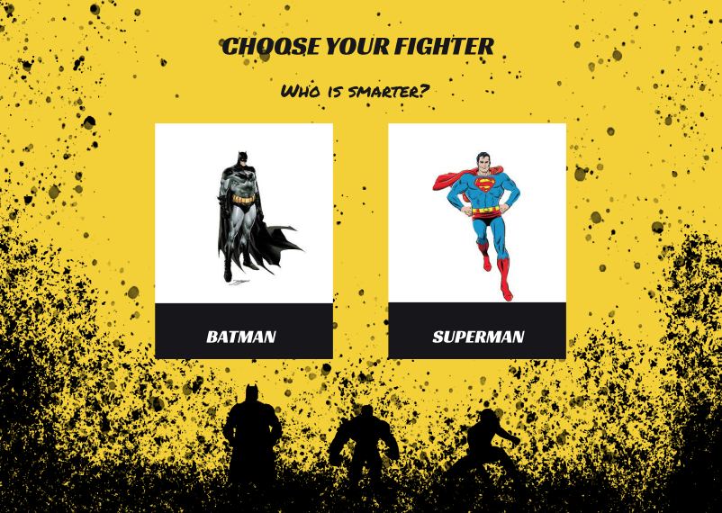
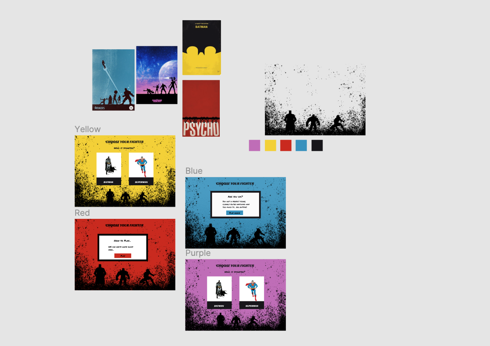
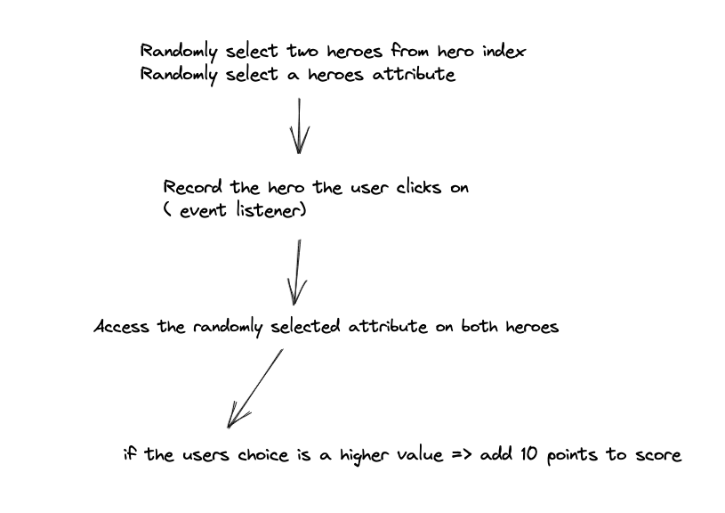

# Choose Your Hero 

Pair coding project Hackathon, Holly Stratton and [Theo Brooke](https://github.com/theobrooke009) (48 hours). 

## Deployment

This project has been deployed with Netlify and can be [seen here](https://choose-your-hero.netlify.app/) 

Technologies used: 
* React.js
* JavaScript (ES6)
* HTML5
* SCSS
* Bulma (CSS Framework)
* [Superheroes API](https://akabab.github.io/superhero-api/api/) 
* Axios
* npm
* React Router

### Getting Started

* Download source code.
* Run `npm i` to install dependencies.
* `npm run start` or `npm run dev`  to run the development server.
* `npm run build` to create a build directory.

## Overview 

My team mate Theo and I had 48 hours to build an app, using React.js and a third party API. We chose to build ‘Choose Your Hero’, a top trumps style game. The player is shown two heroes and has to choose which one they believe ranks higher in a randomly generated attribute, for example who is faster.

After 5 rounds, the player is presented with their score so they can see how good their super hero knowledge is.

We decided to make this game for a few reasons:

* Selecting and comparing the heroes attributes presented interesting coding challenges (particularly dot notation and object manipulation).

* It was an opportunity to firm up our knowledge of using multiple pages and showing and hiding items in React.

* We could further explore setting values into state (to update a score and add functionality to our game logic).

### Gameplay


## Approach




In our planning phase, Theo handled our project timeline, while I focused on the initial design. We then came together to plan and write our code, taking turns to drive and navigate, testing as we went. 

Before coding, we mapped out our game flow as we felt this would help us hone in on specific coding challenges (illustrated in the diagram below).



## The Build

### Selecting and setting two heroes:

Getting two random hero cards was our first coding challenge. After talking the challenge through with our tutor, we understood that we had to take three steps.

Firstly write the logic that selects two heroes into its own function.

``` javascript
function getTwoHeros(heroes) {
  let firstIndex = Math.floor(Math.random() * heroes.length)
  let firstHero = heroes[firstIndex]

  while (!firstHero.id) {
    firstIndex = Math.floor(Math.random() * heroes.length)
    firstHero = heroes[firstIndex]
  }

  let secondIndex = Math.floor(Math.random() * heroes.length)
  let secondHero = heroes[secondIndex]

  while (secondIndex === firstIndex || !secondHero.id) {
    secondIndex = Math.floor(Math.random() * heroes.length)
    secondHero = heroes[secondIndex]
  }
  return [firstHero, secondHero]
}
```

Then use React.useState to set our hero data, and two hero constants.

``` javascript
  const [heroes, setHeroes] = React.useState(null)
  const [heroRight, setHeroRight] = React.useState(null)
  const [heroLeft, setHeroLeft] = React.useState(null)
```
Then we called our hero function inside our useEffect to set our two randomly selected heroes into our hero constants (initially set as empty strings).

``` javascript
  React.useEffect(() => {
    const getData = async () => {
      const response = await getAllHeros()
      setHeroes(response.data)
      console.log(heroes)
      const [first, second] = getTwoHeros(response.data)
      setHeroLeft(first)
      setHeroRight(second)
      setPowerStats(getPowerStat())  
      scoreCheck()
      setTheRound()
    }
    getData()   
  
  },[hasPlayed])
```
This process taught us a lot about how we can set conditions on how we want our data to appear, before we set it into state. 

### Comparing a randomly selected hero attribute:

Our next big challenge was comparing our heroes by a randomly generated attribute.
We broke this challenge down into the following steps:

* Select a random attribute.
* Set this attribute into state and render it into the DOM.
* Record which hero the user clicks on.
* Compare the two heroes values for the chosen attribute, if the player’s chosen hero’s attribute has a higher value, add 10 points to their score.

We decided to try and follow a similar process to our hero selection.

Getting the chosen attribute (known as the powerStat):

``` javascript 
function getPowerStat() {
  const powerStatArray = ['combat', 'durability', 'intelligence', 'power', 'speed', 'strength']
  const chosenStat = powerStatArray[Math.floor(Math.random() * 6)]
  return chosenStat
}
```

Recording the player’s choice:

``` javascript
  function handleClick(e) {
    if (e.currentTarget.innerText === heroLeft.name) {
      setPlayerChoice(heroLeft)  
    } else {
      setPlayerChoice(heroRight) 
    }
    setTimeout(() => {
      setHasPlayed(!hasPlayed)
    }, 800)
  }
```
From here it was a case of deciding if the player had won the round and updating their score:

``` javascript
const isIntelligenceWin = powerStats === 'intelligence' &&
  playerChoice === heroLeft && heroLeft.powerstats.intelligence > heroRight.powerstats.intelligence ||
  playerChoice === heroRight && heroRight.powerstats.intelligence > heroLeft.powerstats.intelligence
```

``` javascript
  function scoreCheck() {
    setRound(round + 1)
    if (isIntelligenceWin){
      return setScore(score + 1)
    } else if (isPowerWin) {
      return setScore(score + 1)
    } else if (isSpeedWin) {   
      return setScore(score + 1)
    } else if (isStrengthWin) {
      return setScore(score + 1)
    } else if (isDurabilityWin){
      return setScore(score + 1)
    } else if (isCombatWin) {
      return setScore(score + 1)
    }
  }
```

## Wins

For us, it was a win to be able to use separate functions to perform this game action. However, our win logic contains a lot of lines of code and ideally, we would have liked to find a more elegant solution.

## Challenges

In addition to the code challenges outlined above, learning to pull the relevant data from a third party API was a great learning experience. At one stage, we were trying to randomly select and compare two heroes by their id. However, after much troubleshooting, we discovered that some characters in the API had the same id, meaning the same card was appearing.

This was a steep learning curve that taught us both not to assume anything about an API!

## Known bugs

* Sometimes only one card appears, as the random hero selection chooses an index that is missing information in the API. 
* Although highly unlikely, the same card can appear more than once in a game.
* Image loading is slow, if I were to visit the project, I would add an image load animation and a loading state.

## Future Features

* Add more search functionality to the Hero index, perhaps filtering by ability or by highest power level.
* A lightbox feature where when the user clicks on a card, the hero’s abilities are revealed.

## Key Learnings

Hackathon code is naturally rough and ready. There are several places where I think we could refine our code, notably in our comparison of hero attributes. However, the project was a great opportunity to firm up my understanding of React states and useEffects, specifically how I can use functions to set how I manipulate and render data in the DOM.

Also, communicating the reasoning behind your code takes a far greater level of understanding. It forces you to revisit your preconceptions and approach your code from different perspectives so you can make sure your team is on the same page. 
You also have to be an empathetic and supportive team player and work out the best way to leverage your team's different strengths to produce the best app you can in a limited time frame.

I really enjoyed working with Theo and am excited to work on more projects in the future with even bigger teams.

This project was bootstrapped with [Create React App](https://github.com/facebook/create-react-app).